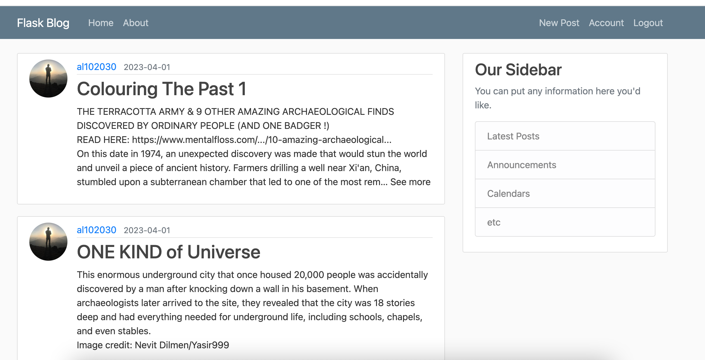

# Simple project by Flask micro web framework
This is a Python Flask Full-Featured Web App that you can create your own blog or website by personalizing and developing this app. In this software, all the basic and essential facilities are created based on the Flask Blueprint.

**Table of contents:**
___
- [Simple project by Flask micro web framework](#simple-project-by-flask-micro-web-framework)
  - [Instructions for setting up Python and dependencies](#instructions-for-setting-up-python-and-dependencies)
  - [Download project to your personal computer](#download-project-to-your-personal-computer)
  - [Dependencies](#dependencies)
  - [Install dependencies](#install-dependencies)
  - [Running project](#running-project)
  - [Congratulations, It's Done!](#congratulations-its-done)
  - [Project interface](#project-interface)


## Instructions for setting up Python and dependencies


- Install Python, preferably version 3.11 and later.
  -  In MacOS, visit [here](https://www.freecodecamp.org/news/python-version-on-mac-update/)

  -  In Linux, visit [here](https://docs.python-guide.org/starting/install3/linux/)
- Install pip by file
  - Download pip file:<br> 
``curl https://bootstrap.pypa.io/get-pip.py -o get-pip.py``

  -  Install pip:<br> 
``python get-pip.py``
- Install pipenv: <br> 
  - ``pip install pipenv``
- Install git
   -  visit [here](https://git-scm.com/book/en/v2/Getting-Started-Installing-Git)

## Download project to your personal computer

Clone project by this command:<br>
``git clone https://github.com/al102030/Simple-project-Flask-.git``


## Dependencies

All requirements that you need to install:
```
bcrypt==4.0.1
blinker==1.6
certifi==2022.12.7
charset-normalizer==3.1.0
click==8.1.3
dnspython==2.3.0
email-validator==1.3.1
flask==2.2.3
flask-bcrypt==1.0.1
flask-login==0.6.2
flask-mail==0.9.1
flask-sqlalchemy==3.0.3
flask-wtf==1.1.1
greenlet==2.0.2
idna==3.4
itsdangerous==2.0.1
jinja2==3.1.2
markupsafe==2.1.2
pillow==9.5.0
requests==2.28.2
sqlalchemy==2.0.8
typing-extensions==4.5.0
urllib3==1.26.15
werkzeug==2.2.3
wtforms==3.0.1
```

## Install dependencies

First enter to project directory:<br>
``cd Simple-project-Flask-``<br>
Install requirements by pipenv:<br>
``pipenv install -r requirements. txt``

## Running project

In the project main directory(Simple-project-Flask-) run this command:<br>
``python run.py``

## Congratulations, It's Done!

In your browser open this linm:<br>
``http://127.0.0.1:5000``
<br>
<br>
<br>
<br>
> ***Congratulations***!<br>
> Now you can develop your own app.

## Project interface




<br>
<br>

> ***Special Thanks to my dear friends***!<br>
> [Corey Schafer](https://github.com/CoreyMSchafer).
> <br>
> [athlonme](https://github.com/athlonme)
> <br>
> [Hesam Mirazimi](https://github.com/hesammirazimi)